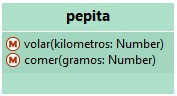
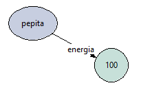
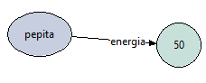
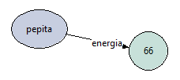

La interfaz del pepita es:



Consultamos la energía de pepita (no produce efecto, sólo retorna un valor):

```wollok
>>> pepita.energia()
100
```

Lo que se ve en el diagrama inicialmente:



Le pedimos que vuele 2 kilómetros (produce efecto, no retorna nada):

```wollok
>>> pepita.volar(2)
```
Lo que se ve en el diagrama:



Si volvemos a consultar su energía, lo que retorna es el nuevo valor referenciado por el atributo de pepita:

```wollok
>>> pepita.energia()
50
```

Le pedimos que coma 8 gramos de alpiste (produce efecto, no retorna nada):

```wollok
>>> pepita.comer(8)
```



Si volvemos a consultar su energía, lo que retorna es el nuevo valor referenciado por el atributo de pepita:

```wollok
>>> pepita.energia()
66
```