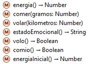
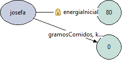
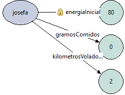
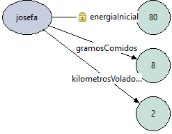
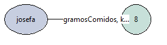

La interfaz del josefa es:



Consultamos la energía de josefa y su estado emocional (no produce efecto, sólo retorna un valor):

```wollok
>>> josefa.energia()
80
>>> josefa.estadoEmocional()
"Indiferente"
```

Lo que se ve en el diagrama inicialmente:



Le pedimos que vuele 2 kilómetros (produce efecto, no retorna nada):

```wollok
>>> josefa.volar(2)
```
Lo que se ve en el diagrama:



Si volvemos a consultar su energía, calcula su energía teniendo en cuenta que voló:

```wollok
>>> josefa.energia()
74
```

Y su estado emocional también retorna algo distinto:

```wollok
>>> josefa.estadoEmocional()
"Explotada"
```

Le pedimos que coma 8 gramos de alpiste (produce efecto, no retorna nada):

```wollok
>>> josefa.comer(8)
```



Si volvemos a consultar su energía:

```wollok
>>> josefa.energia()
114
```

Si le preguntamos su estado emocional nuevamente:

```wollok
>>> josefa.estadoEmocional()
"Bonita y gordita"
```

Si volvemos a hacer que vuele, para que los gramos comidos no superen los kilómetros volados:



Y le preguntamos nuevamente su energía y estado emocional:

```wollok
>>> josefa.energia()
96
>>> josefa.estadoEmocional()
"Energica"
```