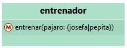

La interfaz del entrenador es:



> Wollok infiere que puede entrenar tanto a josefa como a pepita por los mensajes que se le mandan al pajaro en el método `entrenar(pajaro)` del objeto entrenador.

Inicialmente tenemos estos objetos en el diagrama:


Hacemos que el entrenador entrene a pepita:

```wollok
>>> entrenador.entrenar(pepita)
```

Lo que se ve en el diagrama:


Luego hacemos que el entrenador entrene a josefa:

```wollok
>>> entrenador.entrenar(josefa)
```

Lo que se ve en el diagrama:

