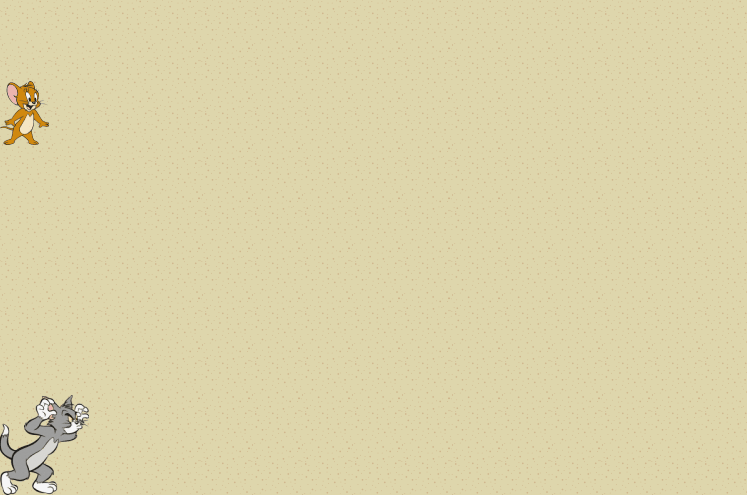

# Tom y Jerry

Estamos armando un juego en el que tenemos a Tom, el gato, que se la pasa persiguiendo a Jerry, un ratón.

Sabemos que Tom tiene una cantidad de energía que varía a lo largo del juego, dependiendo de sus actividades de comer ratones y de correr. También será relevante la velocidad a la que son capaces de correr Tom y Jerry.

Ya disponemos de una implementación para Jerry, y algunas ideas de lo que necesitaremos implementar para Tom en el archivo `tomYJerry.wlk`. A continuación se describen los requerimientos para completar su definición.

## Parte 1

Necesitamos implementar la siguiente lógica para Tom:
- La velocidad de Tom es 5 metros x segundo + (energia medida en joules / 10). 
- Cuando Tom come un ratón, su energía aumenta en 12 joules + el peso del ratón. 
- Cuando Tom corre durante una cantidad de segundos indicada, su energía disminuye en (0.5 x cantidad de metros que corrió).

> Observar que la cuenta para el consumo de energía al correr está en joules consumidos por metro, pero cuando me dicen cuánto corrió, es en segundos. La velocidad a considerar para saber cuántos metros corre en esa cantidad de segundos es la que tiene Tom antes de empezar a correr, no varía durante una carrera.

### Pruebas mínimas

Debemos validar que:
- La velocidad de Tom depende de su energía. Por ejemplo, si tiene 20 joules de energía, su velocidad debería ser 7.
- Cuando Tom come un ratón, su energía aumenta en relación al peso del ratón comido.
- Cuando Tom corre una cantidad de segundos, pierde energía. Debería perder más energía cuando corre rápido que cuando corre lento.

## Parte 2

Necesitamos poder determinar si a Tom le conviene correr a un ratón que se encuentra a una distancia indicada (en metros). Esto será cierto si Tom es más veloz que el ratón, y además la energía que gana por comer al ratón es mayor a la que consume corriendo esa distancia.

### Pruebas mínimas

Debemos validar que:
- A Tom le conviene correr a un ratón que le aporta más energía de la que perdería por correrlo
- A Tom no le conviene correr a un ratón que le aporta menos energía de la que perdería corriéndolo
- A Tom no le conviene correr a un ratón que es más veloz que él, independientemente de la distancia a la que se encuentre

## Para pensar

- ¿Tom es capaz de trabajar con otros ratones con la implementación actual?
- ¿Qué hace falta cumplir para ser considerado un ratón?

---------

## Wollok Game

Disponemos de una interfaz gráfica para "jugar al juego". Si Tom consigue atrapar a Jerry se lo come siguiendo la lógica definida en la **parte 1** del ejercicio, y luego Jerry revivirá más veloz un par de veces.

Con las flechas se puede mover a Tom de a un casillero sin que eso impacte a su energía. 

Y además:
- Usando la **tecla espacio** se le indica a Tom que corra a Jerry (usando la lógica de la **parte 1**)
- Usando la **tecla i** Tom nos dice si le conviene correr a Jerry (usando la lógica de la **parte 2**)
- Usando la **tecla s**... averiguá qué pasa :wink:

> Para correr el juego, seleccioná el archivo `game/tomYJerryGame.wpgm` y correlo con la opción `Run As -> Wollok Program`.