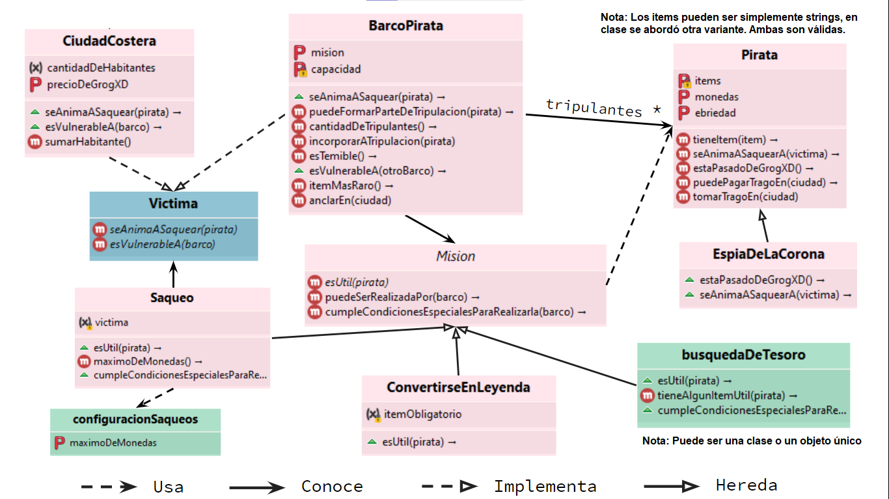

# Práctica: Yaaar!

[Enunciado](https://docs.google.com/document/d/e/2PACX-1vTHVcM-A2FmFpJBKnkpjr8MXI-KsqUp6fm9_GrcP2TUr8aWc5h-Sfj9FY28vVtCwoJ6R-gm1ACIbW8-/pub)

## Diagrama Estático

Diseño general de la solución final (el de la ppt pero con notas adicionales respecto a cómo nos quedó)

