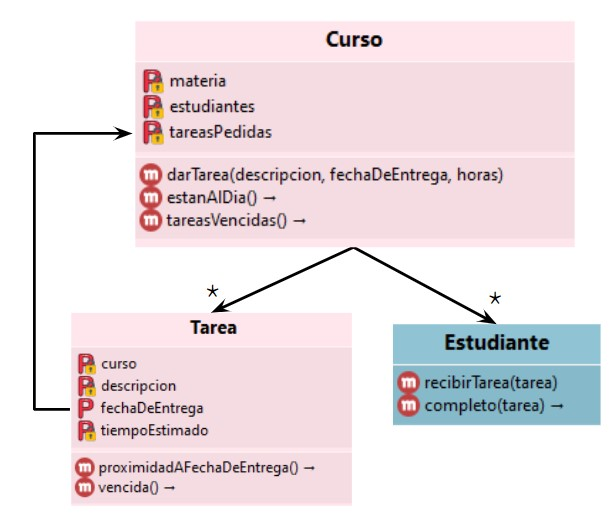

# Estudiantes

## Dominio inicial

Tenemos modelados a los cursos de una carrera universitaria, los cuales son capaces de dar tarea a sus estudiantes.

También pueden decir qué estudiantes están al día (quienes completaron todas las tareas vencidas).

La fecha de entrega de una tarea podría cambiar luego de pedirla.



> No nos interesa cómo se implementan todavía los estudiantes, sólo el uso esperado.

## Estudiantes y tareas

Cuando un estudiante recibe una tarea, no la completa inmediatamente.

Eventualmente un estudiante puede ponerse a estudiar, para trabajar sobre alguna de las tareas que tenga pendientes.

La forma de elegir la tarea a realizar no es igual para todos los estudiantes. Ampliaremos… 

> Por simplicidad, luego de una sesión de estudio, se completa la tarea elegida.

Necesitamos definir para los estudiantes:
- `recibirTarea(tarea)`, para registrar que tiene una nueva tarea
- `estudiar()`, para que elija una tarea pendiente y trabaje sobre ella
- `completo(tarea)` que indique si completó la tarea indicada

Ejemplo de uso:

- Caro recibe 2 tareas, una de ellas también la recibe Leo.
```wollok
>>> caro.recibirTarea(tarea1)
>>> caro.recibirTarea(tarea2)
>>> leo.recibirTarea(tarea1)
```

- Caro estudia, luego de lo cual elige una tarea y la completa. En el ejemplo, la tarea elegida es la misma que recibió Leo. Sólo Caro la completó.
```wollok
>>> caro.estudiar()
>>> caro.completo(tarea1)
true
>>> leo.completo(tarea1)
false
```

- Caro no completó todas sus tareas, sólo la elegida. 
```wollok
>>> caro.completo(tarea2)
false
```

- Tampoco debería ser cierto que Leo haya completado una tarea si no la recibió en primer lugar.
```wollok
>>> leo.completo(tarea2)
false
```

Notar que:
- Muchos estudiantes van a recibir la misma tarea
- Cada estudiante debe poder completar una tarea sin que eso impacte a los demás
- Alguien completó una tarea si efectivamente trabajó sobre ella

### Elección de tareas: Iteración 1

En principio modelaremos sólo a Caro y a Leo. Sabemos que a la hora de elegir sobre qué tarea trabajar:
- Leo elige trabajar sobre la tarea con fecha de entrega más próxima
- Caro elige trabajar sobre la tarea que más tiempo le requiere

Implementar lo necesario para que puedan usarse como en el ejemplo, sin repetir lógica entre Caro y Leo.

### Elección de tareas: Iteración 2

Generalizar lo desarrollado para Caro y Leo para poder tener muchos estudiantes que elijan sus tareas de esa forma.

Decimos que quienes priorizan la fecha de entrega son **"hijos del rigor"**, mientras que quienes se sacan de encima las tareas que requieren más tiempo son estudiantes **prudentes**.

### Elección de tareas: Iteración 3

Nos dimos cuenta de que los estudiantes no eligen siempre de la misma forma.

Queremos hacer que Leo y Caro puedan volverse prudentes / hijos del rigor en cualquier momento.

### Elección de tareas: Iteración 4

Necesitamos agregar formas nuevas de elegir tareas:
- Prioritaria: se debe poder indicar a qué materia se le dará prioridad, y se elige trabajar sobre cualquier tarea, prefiriendo las de esa materia si las hay.
- Remadora: se elige una tarea del curso que el estudiante tenga más colgado (suma de tiempo de tareas pendientes / suma de tiempo de tareas recibidas para ese curso)

## Administración de tiempo

Queremos incorporar dos tipos de estudiantes nuevos: los enfocados y los distraídos. En este caso impacta a cómo les rinde el tiempo para estudiar.

Mientras que a un estudiante común completar una tarea le requiere el tiempo estimado de la misma, a un estudiante enfocado le requiere 2 horas menos (pero nunca menos de una hora).

En cambio, a un distraído, se le suma el nivel de distracción que haya acumulado. Luego de estudiar su nivel de distracción aumenta en una unidad. Además estos estudiantes pueden despejarse, haciendo que su nivel de distracción quede en 0. 

> Pensar cómo se construye un alumno distraído con nivel de distracción de 2 unidades que prioriza las tareas de la materia "PdeP".